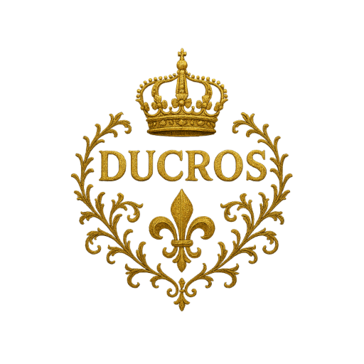

# DCS-Ducros

  
  
  
  
  

<h3 align="center">🇫🇷 Une Infrastructure Blockchain 🇫🇷</h3>
<h6 align="center">s’il n’y a pas de frais, c’est pas français. xD</h6>

  <i>"Transformer chaque appareil en actif générateur de revenus,  tout en préservant la décentralisation et l'accessibilité."</i>

  <a href="#-vision">Vision</a> •
  <a href="#-licence">Licence</a> •
  <a href="#-remerciements">Remerciements</a>

---

## 📖 Introduction

### 🎯 Vision

``dcs-ducros`` est un ``fork`` de ``go-ethereum`` qui remplace le consensus ``Proof-of-Work GPU`` par **RandomX**, un algorithme optimisé pour le ``minage CPU``. Le projet vise à créer une infrastructure blockchain permettant de monétiser les ressources informatiques sous-utilisées des entités publiques, FAI et particuliers.

**Objectif principal** : Générer des revenus passifs pour l'État et ses citoyens tout en maintenant une compatibilité totale avec l'écosystème Ethereum.

## 📜 Licence

**dcs-ducros** est distribué sous ``LGPL-3.0``, identique à [go-ethereum](https://github.com/ethereum/go-ethereum?tab=readme-ov-file#license).
Le code modifié est clairement annoté dans les fichiers sources.

## Remerciements

**Fait avec ❤️ en France, pour le service public et la communauté mondiale**

⭐ **Si ce projet vous plaît, donnez-nous une étoile !** ⭐

